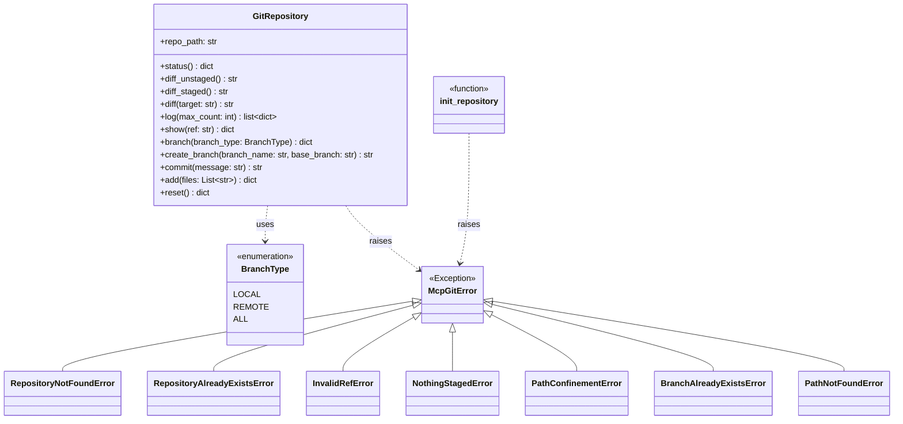

Created: 2026 August 13

# design-5b9d57cb-component_git_operations_repository

**Tier 3: Component Decomposition — Git Operations Layer**

---

## Table of Contents

[1.0 Component Design](<#1.0 component design>)
[2.0 Visual Documentation](<#2.0 visual documentation>)
[3.0 Registry Extension Note](<#3.0 registry extension note>)
[4.0 Cross-References](<#4.0 cross-references>)
[5.0 Tier 3 Review](<#5.0 tier 3 review>)
[Version History](<#version history>)

---

## 1.0 Component Design

```yaml
# T01 Design Template v1.0 - YAML Format - Tier 3: Component Decomposition

project_info:
  name: "git_operations / Git Operations Layer (component)"
  version: "0.1"
  date: "2026-08-13"
  author: "William Watson"

scope:
  purpose: "Implements the 12 git operations against a caller-supplied repository using GitPython, enforcing path confinement and destructive-operation preconditions."
  in_scope:
    - "GitRepository class: 11 methods, one per tool operating on an existing repository"
    - "init_repository module function: the 12th tool, git_init, which by definition has no pre-existing repository to confine"
    - "BranchType enum: local/remote/all selector for git_branch"
    - "Module mcp_git.operations"
  out_scope:
    - "MCP protocol handling, tool registration, annotations — see design-b814443d-component_git_operations_handler.md"
    - "See design-mcp-git-master.md §1.0 scope.out_scope — unchanged at this tier"
  terminology:
    - term: "confinement boundary"
      definition: "The repo_path supplied at GitRepository construction; no method may resolve or act on paths outside this boundary (req 24a9ea35)."

system_overview:
  description: "GitRepository wraps a GitPython Repo object, resolved and confined at construction time. init_repository is a standalone function because it operates before a repository exists. Both raise typed McpGitError subclasses on failure; both return primitive/dict results for the handler layer to serialize."
  context_flow: "GitRepository/init_repository <- MCP Tool Handler Layer; GitRepository/init_repository -> GitPython -> local .git repository"
  primary_functions:
    - "GitRepository.status, diff_unstaged, diff_staged, diff, log, show, branch, create_branch, commit, add, reset"
    - "init_repository"

architecture:
  pattern: "layered (unchanged from Tier 1/2)"
  component_relationships: "MCP Tool Handler Layer -> GitRepository | init_repository -> GitPython -> local .git repository"
  technology_stack:
    language: "Python"
    framework: "GitPython"
    libraries:
      - "GitPython"
    data_store: "none (unchanged from Tier 1)"
  directory_structure:
    - "src/mcp_git/operations.py"

components:
  - name: "Git Operations Layer"
    purpose: "See design-f476c153-domain_git_operations.md §1.0 components[1] — finalised here with complete method signatures."
    responsibilities:
      - "Implement GitRepository, wrapping GitPython's Repo object"
      - "Implement init_repository for repository creation, outside the GitRepository confinement model"
      - "Enforce repo_path confinement (req 24a9ea35) and destructive-operation preconditions (req 6468a270)"
      - "Raise the McpGitError hierarchy on failure; never raise a bare GitPython or builtin exception to the handler layer"
    inputs:
      - field: "repo_path"
        type: "str"
        description: "Filesystem path to the target repository, supplied by every tool call"
    outputs:
      - field: "operation_result"
        type: "dict | str | list[dict]"
        description: "Per-method result; see §1.0 interfaces.internal below for each method's return type"
    key_elements:
      - name: "GitRepository"
        type: "class"
        purpose: "Confined handle to an existing git repository; owns 11 of the 12 operations."
      - name: "init_repository"
        type: "function"
        purpose: "Creates a new git repository at repo_path (the 12th operation, outside GitRepository's confinement model since no repository exists yet)."
      - name: "BranchType"
        type: "class"
        purpose: "str Enum (local, remote, all) selecting branch listing scope for GitRepository.branch."
    dependencies:
      internal: []
      external:
        - "GitPython"
    processing_logic:
      - "GitRepository.__init__ resolves repo_path via GitPython, validates it is an existing repository, and stores the confined Repo handle"
      - "Each method operates only through self._repo (the confined handle); no method accepts or resolves an alternate path"
      - "init_repository validates repo_path does not already contain a .git directory, then calls GitPython's Repo.init"
    error_conditions:
      - condition: "repo_path does not resolve to an existing git repository"
        handling: "GitRepository.__init__ raises RepositoryNotFoundError"
      - condition: "repo_path fails confinement validation (e.g. resolves outside expected boundary)"
        handling: "raise PathConfinementError before any GitPython call"
      - condition: "target/ref does not resolve (diff, show)"
        handling: "raise InvalidRefError"
      - condition: "commit called with an empty index"
        handling: "raise NothingStagedError"
      - condition: "create_branch called with a branch_name that already exists"
        handling: "raise BranchAlreadyExistsError (new at Tier 3 — see §3.0)"
      - condition: "add called with a file path not present in the working tree"
        handling: "raise PathNotFoundError (new at Tier 3 — see §3.0)"
      - condition: "init_repository called on a path that already contains a .git directory"
        handling: "raise RepositoryAlreadyExistsError"

interfaces:
  internal:
    - name: "GitRepository.__init__"
      purpose: "Resolve and confine a repository at repo_path."
      signature: "def __init__(self, repo_path: str) -> None"
      parameters:
        - name: "repo_path"
          type: "str"
          description: "Filesystem path to the target repository."
      returns:
        type: "None"
        description: "Initialises self.repo_path and self._repo (git.Repo)."
      raises:
        - exception: "RepositoryNotFoundError"
          condition: "repo_path does not resolve to an existing git repository"
        - exception: "PathConfinementError"
          condition: "repo_path fails confinement validation"

    - name: "GitRepository.status"
      purpose: "Report working tree status."
      signature: "def status(self) -> dict"
      parameters: []
      returns:
        type: "dict"
        description: "{'staged': list[str], 'unstaged': list[str], 'untracked': list[str], 'clean': bool}"
      raises: []

    - name: "GitRepository.diff_unstaged"
      purpose: "Diff of unstaged working-tree changes."
      signature: "def diff_unstaged(self) -> str"
      parameters: []
      returns:
        type: "str"
        description: "Unified diff text; empty string if no unstaged changes."
      raises: []

    - name: "GitRepository.diff_staged"
      purpose: "Diff of staged (index) changes."
      signature: "def diff_staged(self) -> str"
      parameters: []
      returns:
        type: "str"
        description: "Unified diff text; empty string if the index matches HEAD."
      raises: []

    - name: "GitRepository.diff"
      purpose: "Diff of the working tree against an arbitrary ref."
      signature: "def diff(self, target: str) -> str"
      parameters:
        - name: "target"
          type: "str"
          description: "Branch name, tag, or commit hash to diff against."
      returns:
        type: "str"
        description: "Unified diff text."
      raises:
        - exception: "InvalidRefError"
          condition: "target does not resolve to a valid ref"

    - name: "GitRepository.log"
      purpose: "Commit history."
      signature: "def log(self, max_count: int = DEFAULT_LOG_MAX_COUNT) -> list[dict]"
      parameters:
        - name: "max_count"
          type: "int"
          description: "Maximum number of log entries to return (default DEFAULT_LOG_MAX_COUNT = 10)."
      returns:
        type: "list[dict]"
        description: "Each entry: {'hash': str, 'author': str, 'date': str, 'message': str}"
      raises: []

    - name: "GitRepository.show"
      purpose: "Contents and diff of a specific commit."
      signature: "def show(self, ref: str) -> dict"
      parameters:
        - name: "ref"
          type: "str"
          description: "Commit hash or ref to show."
      returns:
        type: "dict"
        description: "{'hash': str, 'author': str, 'date': str, 'message': str, 'diff': str}"
      raises:
        - exception: "InvalidRefError"
          condition: "ref does not resolve"

    - name: "GitRepository.branch"
      purpose: "List branches."
      signature: "def branch(self, branch_type: BranchType = BranchType.LOCAL) -> dict"
      parameters:
        - name: "branch_type"
          type: "BranchType"
          description: "local, remote, or all (default local)."
      returns:
        type: "dict"
        description: "{'current': str, 'branches': list[str]}"
      raises: []

    - name: "GitRepository.create_branch"
      purpose: "Create a new branch from a base ref."
      signature: "def create_branch(self, branch_name: str, base_branch: Optional[str] = None) -> str"
      parameters:
        - name: "branch_name"
          type: "str"
          description: "Name of the branch to create."
        - name: "base_branch"
          type: "Optional[str]"
          description: "Ref to branch from; defaults to current HEAD when None."
      returns:
        type: "str"
        description: "The created branch name, confirming success."
      raises:
        - exception: "BranchAlreadyExistsError"
          condition: "branch_name already exists"

    - name: "GitRepository.commit"
      purpose: "Create a commit from staged changes."
      signature: "def commit(self, message: str) -> str"
      parameters:
        - name: "message"
          type: "str"
          description: "Commit message."
      returns:
        type: "str"
        description: "The resulting commit hash."
      raises:
        - exception: "NothingStagedError"
          condition: "the index is empty"

    - name: "GitRepository.add"
      purpose: "Stage specified files."
      signature: "def add(self, files: List[str]) -> dict"
      parameters:
        - name: "files"
          type: "List[str]"
          description: "File paths relative to repo_path to stage."
      returns:
        type: "dict"
        description: "{'staged': list[str]}"
      raises:
        - exception: "PathNotFoundError"
          condition: "a specified file path does not exist in the working tree"

    - name: "GitRepository.reset"
      purpose: "Unstage all currently staged changes."
      signature: "def reset(self) -> dict"
      parameters: []
      returns:
        type: "dict"
        description: "{'unstaged_count': int}"
      raises: []

    - name: "init_repository"
      purpose: "Initialise a new git repository at repo_path (module-level; operates before any repository exists)."
      signature: "def init_repository(repo_path: str) -> str"
      parameters:
        - name: "repo_path"
          type: "str"
          description: "Filesystem path at which to create the repository."
      returns:
        type: "str"
        description: "repo_path, confirming the repository was created there."
      raises:
        - exception: "RepositoryAlreadyExistsError"
          condition: "repo_path already contains a .git directory"
  external: []

error_handling:
  exception_hierarchy:
    base: "McpGitError(Exception)"
    specific:
      - "RepositoryNotFoundError(McpGitError)"
      - "RepositoryAlreadyExistsError(McpGitError)"
      - "InvalidRefError(McpGitError)"
      - "NothingStagedError(McpGitError)"
      - "PathConfinementError(McpGitError)"
      - "BranchAlreadyExistsError(McpGitError)   # new at Tier 3, see §3.0"
      - "PathNotFoundError(McpGitError)          # new at Tier 3, see §3.0"
  strategy:
    validation_errors: "Confinement and precondition checks run before any GitPython call; raised as the specific McpGitError subclass listed above."
    runtime_errors: "Unexpected GitPython exceptions are caught and wrapped in the most specific applicable McpGitError subclass, or McpGitError itself if none fits."
    external_failures: "Not applicable — no network dependency (req 30130de3)."
  logging:
    levels:
      - "INFO"
      - "ERROR"
    required_info:
      - "method name"
      - "repo_path"
      - "exception type (on error)"
    format: "flat file, per project logging convention"

element_registry:
  packages: []
  modules:
    - name: "mcp_git.operations"
      path: "src/mcp_git/operations.py"
      package: "mcp_git"
  classes:
    - name: "BranchType"
      module: "mcp_git.operations"
      base_classes:
        - "str"
        - "Enum"
  functions:
    - name: "GitRepository.__init__"
      module: "mcp_git.operations"
      signature: "def __init__(self, repo_path: str) -> None"
    - name: "GitRepository.status"
      module: "mcp_git.operations"
      signature: "def status(self) -> dict"
    - name: "GitRepository.diff_unstaged"
      module: "mcp_git.operations"
      signature: "def diff_unstaged(self) -> str"
    - name: "GitRepository.diff_staged"
      module: "mcp_git.operations"
      signature: "def diff_staged(self) -> str"
    - name: "GitRepository.diff"
      module: "mcp_git.operations"
      signature: "def diff(self, target: str) -> str"
    - name: "GitRepository.log"
      module: "mcp_git.operations"
      signature: "def log(self, max_count: int = DEFAULT_LOG_MAX_COUNT) -> list[dict]"
    - name: "GitRepository.show"
      module: "mcp_git.operations"
      signature: "def show(self, ref: str) -> dict"
    - name: "GitRepository.branch"
      module: "mcp_git.operations"
      signature: "def branch(self, branch_type: BranchType = BranchType.LOCAL) -> dict"
    - name: "GitRepository.create_branch"
      module: "mcp_git.operations"
      signature: "def create_branch(self, branch_name: str, base_branch: Optional[str] = None) -> str"
    - name: "GitRepository.commit"
      module: "mcp_git.operations"
      signature: "def commit(self, message: str) -> str"
    - name: "GitRepository.add"
      module: "mcp_git.operations"
      signature: "def add(self, files: List[str]) -> dict"
    - name: "GitRepository.reset"
      module: "mcp_git.operations"
      signature: "def reset(self) -> dict"
    - name: "init_repository"
      module: "mcp_git.operations"
      signature: "def init_repository(repo_path: str) -> str"
  constants:
    - name: "DEFAULT_LOG_MAX_COUNT"
      module: "mcp_git.operations"
      type: "int"

version_history:
  - version: "0.1"
    date: "2026-08-13"
    author: "William Watson"
    changes:
      - "Tier 3 component design: Git Operations Layer, initial draft, pending human review"

metadata:
  copyright: "Copyright (c) 2026 William Watson. MIT License."
  template_version: "1.0"
  schema_type: "t01_design"
```

[Return to Table of Contents](<#table of contents>)

---

## 2.0 Visual Documentation

Purpose: shows GitRepository's methods and the finalised exception hierarchy, including the two exceptions added at this tier.



Legend: `<|--` inheritance, `..>` raises/uses dependency. `BranchAlreadyExistsError` and `PathNotFoundError` are additions beyond the Tier 2 baseline — see §3.0.

Cross-reference: `interfaces.internal` and `error_handling` in §1.0 above.

[Return to Table of Contents](<#table of contents>)

---

## 3.0 Registry Extension Note

Tier 2 (`design-f476c153-domain_git_operations.md`) approved a 5-member exception set: `RepositoryNotFoundError`, `RepositoryAlreadyExistsError`, `InvalidRefError`, `NothingStagedError`, `PathConfinementError`. Finalising complete method signatures at this tier surfaced two failure conditions not covered by that set:

- **`BranchAlreadyExistsError`** — `git_create_branch` (req `56c8f711`) must fail with a clear error when `branch_name` already exists; none of the five approved exceptions names this condition specifically.
- **`PathNotFoundError`** — `git_add` (req `3337bf9f`) must fail with a clear error when a specified file path does not exist in the working tree; likewise uncovered.

Both are interface-detail completions of already-approved functional requirements, not new functionality — no tool, requirement, or behaviour is added beyond what was baselined at P10 and Tier 1/2. Flagged here per governance rather than added silently.

[Return to Table of Contents](<#table of contents>)

---

## 4.0 Cross-References

- **Parent (Tier 2):** [design-f476c153-domain_git_operations.md](design-f476c153-domain_git_operations.md)
- **Sibling (Tier 3):** [design-b814443d-component_git_operations_handler.md](design-b814443d-component_git_operations_handler.md)
- **Name registry:** [design-mcp-git-name_registry-master.md](design-mcp-git-name_registry-master.md) — finalised with this component's classes, functions, and constants

[Return to Table of Contents](<#table of contents>)

---

## 5.0 Tier 3 Review

- **Reviewer:** pending
- **Date:** pending
- **Findings:** pending
- **Decision:** pending human approval before T04 prompt creation (governance §1.3.6)

[Return to Table of Contents](<#table of contents>)

---

## Version History

| Version | Date | Description |
|---|---|---|
| 0.1 | 2026-08-13 | Tier 3 component design: Git Operations Layer, initial draft, pending human review |

---

Copyright (c) 2026 William Watson. MIT License.
