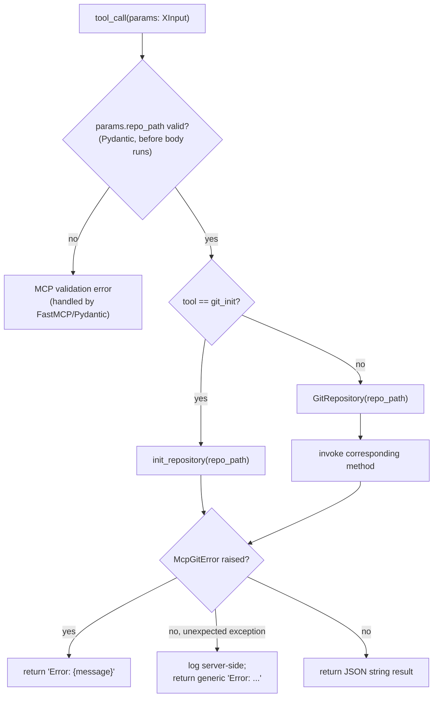

Created: 2026 August 13

# design-b814443d-component_git_operations_handler

**Tier 3: Component Decomposition — MCP Tool Handler Layer**

---

## Table of Contents

[1.0 Component Design](<#1.0 component design>)
[2.0 Tool Annotations](<#2.0 tool annotations>)
[3.0 Visual Documentation](<#3.0 visual documentation>)
[4.0 Cross-References](<#4.0 cross-references>)
[5.0 Tier 3 Review](<#5.0 tier 3 review>)
[Version History](<#version history>)

---

## 1.0 Component Design

```yaml
# T01 Design Template v1.0 - YAML Format - Tier 3: Component Decomposition

project_info:
  name: "git_operations / MCP Tool Handler Layer (component)"
  version: "0.1"
  date: "2026-08-13"
  author: "William Watson"

scope:
  purpose: "Registers the 12 MCP tools with FastMCP, validates input via Pydantic models, dispatches to the Git Operations Layer, and formats structured MCP results and errors."
  in_scope:
    - "12 async tool functions, one per requirement in requirements-mcp-git-master.md functional_requirements"
    - "12 Pydantic input models, one per tool"
    - "Tool annotation (readOnlyHint, destructiveHint, idempotentHint, openWorldHint) per req fab9139d, extended per mcp-builder skill convention"
    - "Module mcp_git.server"
  out_scope:
    - "git operation implementation — see design-5b9d57cb-component_git_operations_repository.md"
    - "See design-mcp-git-master.md §1.0 scope.out_scope — unchanged at this tier"
  terminology:
    - term: "structured error response"
      definition: "An MCP tool result string beginning 'Error: ', carrying a human-readable message, never a raw Python traceback (req 54f3d219)."

system_overview:
  description: "Each tool function accepts one Pydantic input model, constructs a GitRepository at params.repo_path (or calls init_repository directly for git_init), invokes the corresponding Git Operations Layer method, and returns a JSON-formatted string result. McpGitError subclasses are caught and translated to structured error strings; unexpected exceptions are caught, logged, and translated to a generic structured error without leaking internal detail."
  context_flow: "MCP Client -> FastMCP -> tool function -> GitRepository | init_repository -> JSON string result -> MCP Client"
  primary_functions:
    - "git_status, git_diff_unstaged, git_diff_staged, git_diff, git_log, git_show, git_branch, git_create_branch, git_commit, git_add, git_reset, git_init"

architecture:
  pattern: "layered (unchanged from Tier 1/2)"
  component_relationships: "FastMCP -> tool function -> GitRepository | init_repository"
  technology_stack:
    language: "Python"
    framework: "MCP Python SDK (FastMCP)"
    libraries:
      - "mcp"
      - "pydantic"
    data_store: "none (unchanged from Tier 1)"
  directory_structure:
    - "src/mcp_git/server.py"

components:
  - name: "MCP Tool Handler Layer"
    purpose: "See design-f476c153-domain_git_operations.md §1.0 components[0] — finalised here with complete tool function signatures and input models."
    responsibilities:
      - "Register all 12 tools via @mcp.tool with name and full annotation set (§2.0)"
      - "Validate input via Pydantic (no manual validation)"
      - "Translate Git Operations Layer exceptions into structured MCP error responses (req 54f3d219)"
    inputs:
      - field: "tool_call"
        type: "MCP protocol message"
        description: "Tool name plus a Pydantic-validated input model instance"
    outputs:
      - field: "tool_result"
        type: "str"
        description: "JSON-formatted success result, or a structured 'Error: ...' string"
    key_elements:
      - name: "(12 tool functions and 12 Pydantic input models — see §1.0 interfaces.internal)"
        type: "function"
        purpose: "One handler per tool, per requirements-mcp-git-master.md functional_requirements"
    dependencies:
      internal:
        - "GitRepository, init_repository (Git Operations Layer)"
        - "McpGitError hierarchy (mcp_git.errors)"
      external:
        - "mcp (MCP Python SDK / FastMCP)"
        - "pydantic"
    processing_logic:
      - "Receive tool call with a validated Pydantic input model"
      - "Construct GitRepository(params.repo_path), except git_init which calls init_repository(params.repo_path) directly"
      - "Invoke the corresponding Git Operations Layer method with the remaining validated parameters"
      - "Serialise the result to a JSON string and return it"
    error_conditions:
      - condition: "McpGitError (or subclass) raised by the Git Operations Layer"
        handling: "return f'Error: {message}' — no traceback, per req 54f3d219"
      - condition: "unexpected (non-McpGitError) exception raised"
        handling: "log the exception server-side; return a generic 'Error: an unexpected error occurred' string, never the raw exception"

interfaces:
  internal:
    - name: "git_status"
      purpose: "Handler for req fedee316."
      signature: "async def git_status(params: GitStatusInput) -> str"
      parameters:
        - name: "params"
          type: "GitStatusInput"
          description: "repo_path: str"
      returns:
        type: "str"
        description: "JSON string of GitRepository.status() result, or a structured error string."
      raises: []

    - name: "git_diff_unstaged"
      purpose: "Handler for req 08da738e."
      signature: "async def git_diff_unstaged(params: GitDiffUnstagedInput) -> str"
      parameters:
        - name: "params"
          type: "GitDiffUnstagedInput"
          description: "repo_path: str"
      returns:
        type: "str"
        description: "Unified diff text (as returned by GitRepository.diff_unstaged()), or a structured error string."
      raises: []

    - name: "git_diff_staged"
      purpose: "Handler for req 7e8bfefa."
      signature: "async def git_diff_staged(params: GitDiffStagedInput) -> str"
      parameters:
        - name: "params"
          type: "GitDiffStagedInput"
          description: "repo_path: str"
      returns:
        type: "str"
        description: "Unified diff text, or a structured error string."
      raises: []

    - name: "git_diff"
      purpose: "Handler for req 2f0a1f17."
      signature: "async def git_diff(params: GitDiffInput) -> str"
      parameters:
        - name: "params"
          type: "GitDiffInput"
          description: "repo_path: str, target: str"
      returns:
        type: "str"
        description: "Unified diff text, or a structured error string (e.g. on InvalidRefError)."
      raises: []

    - name: "git_log"
      purpose: "Handler for req aa27e381."
      signature: "async def git_log(params: GitLogInput) -> str"
      parameters:
        - name: "params"
          type: "GitLogInput"
          description: "repo_path: str, max_count: int = DEFAULT_LOG_MAX_COUNT"
      returns:
        type: "str"
        description: "JSON string of GitRepository.log() result, or a structured error string."
      raises: []

    - name: "git_show"
      purpose: "Handler for req 8a1fefa4."
      signature: "async def git_show(params: GitShowInput) -> str"
      parameters:
        - name: "params"
          type: "GitShowInput"
          description: "repo_path: str, ref: str"
      returns:
        type: "str"
        description: "JSON string of GitRepository.show() result, or a structured error string (e.g. on InvalidRefError)."
      raises: []

    - name: "git_branch"
      purpose: "Handler for req 0931a0d8."
      signature: "async def git_branch(params: GitBranchInput) -> str"
      parameters:
        - name: "params"
          type: "GitBranchInput"
          description: "repo_path: str, branch_type: BranchType = BranchType.LOCAL"
      returns:
        type: "str"
        description: "JSON string of GitRepository.branch() result, or a structured error string."
      raises: []

    - name: "git_create_branch"
      purpose: "Handler for req 56c8f711."
      signature: "async def git_create_branch(params: GitCreateBranchInput) -> str"
      parameters:
        - name: "params"
          type: "GitCreateBranchInput"
          description: "repo_path: str, branch_name: str, base_branch: Optional[str] = None"
      returns:
        type: "str"
        description: "Confirmation string, or a structured error string (e.g. on BranchAlreadyExistsError)."
      raises: []

    - name: "git_commit"
      purpose: "Handler for req 74ef324d."
      signature: "async def git_commit(params: GitCommitInput) -> str"
      parameters:
        - name: "params"
          type: "GitCommitInput"
          description: "repo_path: str, message: str"
      returns:
        type: "str"
        description: "The resulting commit hash, or a structured error string (e.g. on NothingStagedError)."
      raises: []

    - name: "git_add"
      purpose: "Handler for req 3337bf9f."
      signature: "async def git_add(params: GitAddInput) -> str"
      parameters:
        - name: "params"
          type: "GitAddInput"
          description: "repo_path: str, files: List[str]"
      returns:
        type: "str"
        description: "JSON string of GitRepository.add() result, or a structured error string (e.g. on PathNotFoundError)."
      raises: []

    - name: "git_reset"
      purpose: "Handler for req 68fbcc16."
      signature: "async def git_reset(params: GitResetInput) -> str"
      parameters:
        - name: "params"
          type: "GitResetInput"
          description: "repo_path: str"
      returns:
        type: "str"
        description: "JSON string of GitRepository.reset() result, or a structured error string."
      raises: []

    - name: "git_init"
      purpose: "Handler for req 1c3f7c0f."
      signature: "async def git_init(params: GitInitInput) -> str"
      parameters:
        - name: "params"
          type: "GitInitInput"
          description: "repo_path: str"
      returns:
        type: "str"
        description: "Confirmation string (repo_path), or a structured error string (e.g. on RepositoryAlreadyExistsError)."
      raises: []
  external:
    - name: "MCP stdio interface"
      protocol: "MCP (Model Context Protocol) over stdio"
      data_format: "JSON-RPC (MCP protocol envelope)"
      specification: "FastMCP server exposing the 12 tools listed above"

error_handling:
  exception_hierarchy:
    base: "McpGitError (imported from mcp_git.errors — not redefined here)"
    specific: []
  strategy:
    validation_errors: "Handled by Pydantic at the input-model boundary before any tool function body executes."
    runtime_errors: "McpGitError subclasses caught per tool and translated to 'Error: {message}'; unexpected exceptions logged and translated to a generic structured error."
    external_failures: "Not applicable — no network dependency (req 30130de3)."
  logging:
    levels:
      - "INFO"
      - "ERROR"
    required_info:
      - "tool name"
      - "repo_path"
      - "exception type (on error)"
    format: "flat file, per project logging convention"

element_registry:
  packages: []
  modules:
    - name: "mcp_git.server"
      path: "src/mcp_git/server.py"
      package: "mcp_git"
  classes:
    - name: "GitStatusInput"
      module: "mcp_git.server"
      base_classes: ["BaseModel"]
    - name: "GitDiffUnstagedInput"
      module: "mcp_git.server"
      base_classes: ["BaseModel"]
    - name: "GitDiffStagedInput"
      module: "mcp_git.server"
      base_classes: ["BaseModel"]
    - name: "GitDiffInput"
      module: "mcp_git.server"
      base_classes: ["BaseModel"]
    - name: "GitLogInput"
      module: "mcp_git.server"
      base_classes: ["BaseModel"]
    - name: "GitShowInput"
      module: "mcp_git.server"
      base_classes: ["BaseModel"]
    - name: "GitBranchInput"
      module: "mcp_git.server"
      base_classes: ["BaseModel"]
    - name: "GitCreateBranchInput"
      module: "mcp_git.server"
      base_classes: ["BaseModel"]
    - name: "GitCommitInput"
      module: "mcp_git.server"
      base_classes: ["BaseModel"]
    - name: "GitAddInput"
      module: "mcp_git.server"
      base_classes: ["BaseModel"]
    - name: "GitResetInput"
      module: "mcp_git.server"
      base_classes: ["BaseModel"]
    - name: "GitInitInput"
      module: "mcp_git.server"
      base_classes: ["BaseModel"]
  functions:
    - name: "git_status"
      module: "mcp_git.server"
      signature: "async def git_status(params: GitStatusInput) -> str"
    - name: "git_diff_unstaged"
      module: "mcp_git.server"
      signature: "async def git_diff_unstaged(params: GitDiffUnstagedInput) -> str"
    - name: "git_diff_staged"
      module: "mcp_git.server"
      signature: "async def git_diff_staged(params: GitDiffStagedInput) -> str"
    - name: "git_diff"
      module: "mcp_git.server"
      signature: "async def git_diff(params: GitDiffInput) -> str"
    - name: "git_log"
      module: "mcp_git.server"
      signature: "async def git_log(params: GitLogInput) -> str"
    - name: "git_show"
      module: "mcp_git.server"
      signature: "async def git_show(params: GitShowInput) -> str"
    - name: "git_branch"
      module: "mcp_git.server"
      signature: "async def git_branch(params: GitBranchInput) -> str"
    - name: "git_create_branch"
      module: "mcp_git.server"
      signature: "async def git_create_branch(params: GitCreateBranchInput) -> str"
    - name: "git_commit"
      module: "mcp_git.server"
      signature: "async def git_commit(params: GitCommitInput) -> str"
    - name: "git_add"
      module: "mcp_git.server"
      signature: "async def git_add(params: GitAddInput) -> str"
    - name: "git_reset"
      module: "mcp_git.server"
      signature: "async def git_reset(params: GitResetInput) -> str"
    - name: "git_init"
      module: "mcp_git.server"
      signature: "async def git_init(params: GitInitInput) -> str"
  constants: []

version_history:
  - version: "0.1"
    date: "2026-08-13"
    author: "William Watson"
    changes:
      - "Tier 3 component design: MCP Tool Handler Layer, initial draft, pending human review"

metadata:
  copyright: "Copyright (c) 2026 William Watson. MIT License."
  template_version: "1.0"
  schema_type: "t01_design"
```

[Return to Table of Contents](<#table of contents>)

---

## 2.0 Tool Annotations

Per req `fab9139d` (read-only vs. destructive) extended with `idempotentHint` / `openWorldHint` per the mcp-builder skill convention. `openWorldHint` is `false` for every tool — no external entities are involved (req `30130de3`).

| Tool | readOnlyHint | destructiveHint | idempotentHint | openWorldHint |
|---|---|---|---|---|
| git_status | true | false | true | false |
| git_diff_unstaged | true | false | true | false |
| git_diff_staged | true | false | true | false |
| git_diff | true | false | true | false |
| git_log | true | false | true | false |
| git_show | true | false | true | false |
| git_branch | true | false | true | false |
| git_create_branch | false | false | false | false |
| git_commit | false | false | false | false |
| git_add | false | false | true | false |
| git_reset | false | true | true | false |
| git_init | false | false | false | false |

Notes: `git_reset` is marked `destructiveHint: true` because it discards staged intent (the index), even though it does not touch the working tree. `git_create_branch`, `git_commit`, and `git_init` are not idempotent — a second identical call fails or changes state further, rather than having no additional effect. `git_add` and `git_reset` are idempotent — repeating either against an already-staged/already-empty index leaves the same end state.

[Return to Table of Contents](<#table of contents>)

---

## 3.0 Visual Documentation

Purpose: shows the handler-layer dispatch pattern shared by all 12 tools, and the two exception-handling paths.



Legend: this flow is identical across all 12 tool functions, differing only in the operations-layer call at steps E/F/G. Cross-reference: §1.0 `processing_logic` and `error_conditions`.

[Return to Table of Contents](<#table of contents>)

---

## 4.0 Cross-References

- **Parent (Tier 2):** [design-f476c153-domain_git_operations.md](design-f476c153-domain_git_operations.md)
- **Sibling (Tier 3):** [design-5b9d57cb-component_git_operations_repository.md](design-5b9d57cb-component_git_operations_repository.md)
- **Name registry:** [design-mcp-git-name_registry-master.md](design-mcp-git-name_registry-master.md) — finalised with this component's classes and functions

[Return to Table of Contents](<#table of contents>)

---

## 5.0 Tier 3 Review

- **Reviewer:** William Watson
- **Date:** 2026-08-13
- **Findings:** None requiring change.
- **Decision:** Approved.
- **Outcome:** Tier 3 baseline established for this component; T04 prompt creation authorised per governance §1.3.6.

[Return to Table of Contents](<#table of contents>)

---

## Version History

| Version | Date | Description |
|---|---|---|
| 0.1 | 2026-08-13 | Tier 3 component design: MCP Tool Handler Layer, initial draft, pending human review |
| 0.2 | 2026-08-13 | Tier 3 approved; §5.0 Tier 3 Review recorded |

---

Copyright (c) 2026 William Watson. MIT License.
