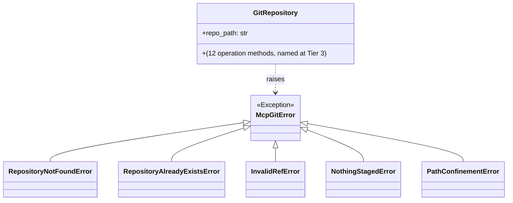

Created: 2026 August 13

# design-f476c153-domain_git_operations

**Tier 2: Domain Decomposition — single domain**

---

## Table of Contents

[1.0 Domain Design](<#1.0 domain design>)
[2.0 Visual Documentation](<#2.0 visual documentation>)
[3.0 Cross-References](<#3.0 cross-references>)
[4.0 Tier 2 Review](<#4.0 tier 2 review>)
[Version History](<#version history>)

---

## 1.0 Domain Design

```yaml
# T01 Design Template v1.0 - YAML Format - Tier 2: Domain Decomposition

project_info:
  name: "git_operations (domain)"
  version: "0.1"
  date: "2026-08-13"
  author: "William Watson"

scope:
  purpose: "The single Tier 2 domain covering all mcp-git functionality: repository state inspection (7 read-only tools) and repository mutation (5 destructive tools). A single-domain decomposition was chosen at Tier 2 scoping given the project's single-package scale (see design-mcp-git-master.md §5.0)."
  in_scope:
    - "All 12 MCP tools (git_status, git_diff_unstaged, git_diff_staged, git_diff, git_log, git_show, git_branch, git_create_branch, git_commit, git_add, git_reset, git_init)"
    - "Both Tier 1 components: MCP Tool Handler Layer and Git Operations Layer"
  out_scope:
    - "See design-mcp-git-master.md §1.0 scope.out_scope — unchanged at this tier"
  terminology:
    - term: "domain boundary"
      definition: "For this project, the domain boundary is coextensive with the whole system boundary defined at Tier 1, since a single domain was selected."

system_overview:
  description: "This domain owns both Tier 1 components. It introduces two key classes not yet named at Tier 1: GitRepository, encapsulating a confined git repository, and the McpGitError exception hierarchy."
  context_flow: "MCP Client -> MCP Tool Handler Layer -> GitRepository (Git Operations Layer) -> GitPython -> local git repository"
  primary_functions:
    - "See design-mcp-git-master.md §1.0 system_overview.primary_functions — unchanged at this tier"

architecture:
  pattern: "layered (unchanged from Tier 1)"
  component_relationships: "MCP Tool Handler Layer -> GitRepository -> GitPython -> local .git repository"
  technology_stack:
    language: "Python"
    framework: "MCP Python SDK (mcp)"
    libraries:
      - "mcp"
      - "GitPython"
    data_store: "none (unchanged from Tier 1)"
  directory_structure:
    - "See design-mcp-git-master.md §1.0 architecture.directory_structure — unchanged at this tier"

components:
  - name: "MCP Tool Handler Layer"
    purpose: "See design-mcp-git-master.md §1.0 components[0] — unchanged at this tier."
    responsibilities:
      - "See design-mcp-git-master.md §1.0 components[0].responsibilities"
    inputs: []
    outputs: []
    key_elements:
      - name: "(finalised at Tier 3)"
        type: "function"
        purpose: "One handler function per tool"
    dependencies:
      internal:
        - "GitRepository (Git Operations Layer)"
      external:
        - "mcp (MCP Python SDK)"
    processing_logic: []
    error_conditions: []

  - name: "Git Operations Layer"
    purpose: "Implements all 12 git operations via the GitRepository class, enforcing path confinement and destructive-operation preconditions."
    responsibilities:
      - "Implement GitRepository, wrapping GitPython's Repo object"
      - "Enforce repo_path confinement (req 24a9ea35)"
      - "Raise the McpGitError hierarchy on failure"
    inputs: []
    outputs: []
    key_elements:
      - name: "GitRepository"
        type: "class"
        purpose: "Confined handle to a single git repository; owns all 12 operation methods (named and signed at Tier 3)"
    dependencies:
      internal: []
      external:
        - "GitPython"
    processing_logic: []
    error_conditions: []

interfaces:
  internal:
    - name: "GitRepository"
      purpose: "Encapsulates a confined git repository at repo_path; wraps a GitPython Repo object; exposes the 12 git operations as methods (named and signed at Tier 3)."
      signature: "class GitRepository(repo_path: str)"
      parameters:
        - name: "repo_path"
          type: "str"
          description: "Filesystem path to the target repository; establishes the confinement boundary for this instance (req 24a9ea35)."
      returns:
        type: "GitRepository"
        description: "A confined repository handle used for all subsequent operation calls."
      raises:
        - exception: "RepositoryNotFoundError"
          condition: "repo_path does not resolve to an existing git repository (all tools except git_init)"
        - exception: "PathConfinementError"
          condition: "repo_path fails confinement validation"
    - name: "McpGitError"
      purpose: "Base exception for all mcp-git domain errors; caught by the MCP Tool Handler Layer and translated into structured MCP error responses (req 54f3d219)."
      signature: "class McpGitError(Exception)"
      parameters: []
      returns:
        type: "n/a"
        description: "Exception class; not called directly."
      raises: []
  external: []

error_handling:
  exception_hierarchy:
    base: "McpGitError(Exception)"
    specific:
      - "RepositoryNotFoundError(McpGitError)"
      - "RepositoryAlreadyExistsError(McpGitError)"
      - "InvalidRefError(McpGitError)"
      - "NothingStagedError(McpGitError)"
      - "PathConfinementError(McpGitError)"
  strategy:
    validation_errors: "See design-mcp-git-master.md §1.0 error_handling.strategy — unchanged at this tier"
    runtime_errors: "See design-mcp-git-master.md §1.0 error_handling.strategy — unchanged at this tier"
    external_failures: "Not applicable — unchanged at this tier"
  logging:
    levels: []
    required_info: []
    format: ""

element_registry:
  # Tier 2: adds key class names for this domain. Functions/constants remain Tier 3.
  packages: []
  modules: []
  classes:
    - name: "GitRepository"
      module: "mcp_git.operations"
      base_classes: []
    - name: "McpGitError"
      module: "mcp_git.errors"
      base_classes:
        - "Exception"
    - name: "RepositoryNotFoundError"
      module: "mcp_git.errors"
      base_classes:
        - "McpGitError"
    - name: "RepositoryAlreadyExistsError"
      module: "mcp_git.errors"
      base_classes:
        - "McpGitError"
    - name: "InvalidRefError"
      module: "mcp_git.errors"
      base_classes:
        - "McpGitError"
    - name: "NothingStagedError"
      module: "mcp_git.errors"
      base_classes:
        - "McpGitError"
    - name: "PathConfinementError"
      module: "mcp_git.errors"
      base_classes:
        - "McpGitError"
  functions: []
  constants: []

version_history:
  - version: "0.1"
    date: "2026-08-13"
    author: "William Watson"
    changes:
      - "Tier 2 domain design, single domain (git_operations), initial draft, pending human review"

metadata:
  copyright: "Copyright (c) 2026 William Watson. MIT License."
  template_version: "1.0"
  schema_type: "t01_design"
```

[Return to Table of Contents](<#table of contents>)

---

## 2.0 Visual Documentation

Purpose: shows the class-level relationships introduced at this tier — the confined repository handle and the exception hierarchy it raises.



Legend: `<|--` denotes inheritance; `..>` denotes a raises/uses dependency, not inheritance.

Cross-reference: `interfaces.internal` and `error_handling.exception_hierarchy` in §1.0 above.

[Return to Table of Contents](<#table of contents>)

---

## 3.0 Cross-References

- **Parent (Tier 1):** [design-mcp-git-master.md](design-mcp-git-master.md)
- **Children (Tier 3):**
  - [design-b814443d-component_git_operations_handler.md](design-b814443d-component_git_operations_handler.md)
  - [design-5b9d57cb-component_git_operations_repository.md](design-5b9d57cb-component_git_operations_repository.md)
- **Name registry:** [design-mcp-git-name_registry-master.md](design-mcp-git-name_registry-master.md) — extended with this domain's classes, finalised at Tier 3

[Return to Table of Contents](<#table of contents>)

---

## 4.0 Tier 2 Review

- **Reviewer:** William Watson
- **Date:** 2026-08-13
- **Findings:** None requiring change.
- **Decision:** Approved.
- **Outcome:** Tier 2 baseline established; Tier 3 component decomposition authorised per governance §1.3.4.

[Return to Table of Contents](<#table of contents>)

---

## Version History

| Version | Date | Description |
|---|---|---|
| 0.1 | 2026-08-13 | Tier 2 domain design, single domain, initial draft, pending human review |
| 0.2 | 2026-08-13 | Tier 2 approved; §4.0 Tier 2 Review recorded |
| 0.3 | 2026-08-13 | §3.0 Cross-References updated with the two Tier 3 component designs |

---

Copyright (c) 2026 William Watson. MIT License.
