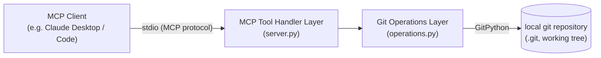
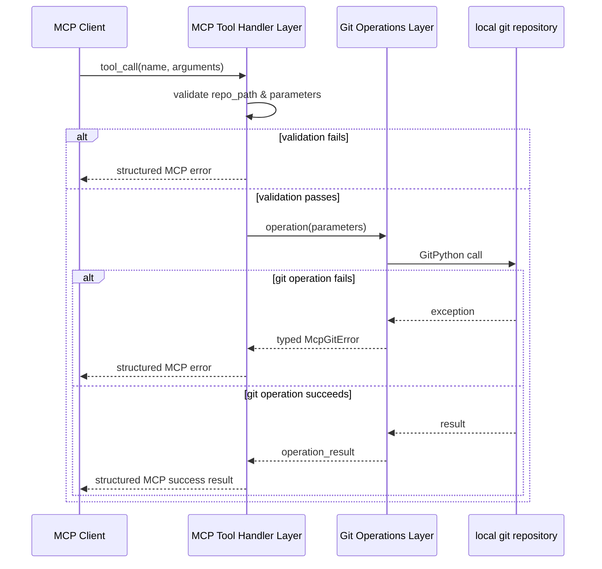

Created: 2026 August 13

# design-mcp-git-master

**Master Design Document — Tier 1: System Architecture**

---

## Table of Contents

[1.0 Design](<#1.0 design>)
[2.0 Visual Documentation](<#2.0 visual documentation>)
[2.1 System Architecture](<#2.1 system architecture>)
[2.2 Component Interaction](<#2.2 component interaction>)
[3.0 Requirements Coverage](<#3.0 requirements coverage>)
[4.0 Child Documents](<#4.0 child documents>)
[5.0 Tier 1 Review](<#5.0 tier 1 review>)
[Version History](<#version history>)

---

## 1.0 Design

```yaml
# T01 Design Template v1.0 - YAML Format - Tier 1: System Architecture

project_info:
  name: "mcp-git"
  version: "0.1"
  date: "2026-08-13"
  author: "William Watson"

scope:
  purpose: "A local, stdio-transport MCP server exposing git working-tree and repository operations to MCP clients, with full tool parity to the MCP steering group reference git server implementation."
  in_scope:
    - "12 MCP tools: git_status, git_diff_unstaged, git_diff_staged, git_diff, git_log, git_show, git_branch, git_create_branch, git_commit, git_add, git_reset, git_init"
    - "Local stdio transport"
    - "Single-repository-per-call operation, repo_path supplied by the caller on every tool invocation"
  out_scope:
    - "Remote operations (push, pull, fetch, clone)"
    - "HTTP/SSE transport"
    - "Multi-repository session or connection state"
    - "Authentication/authorization beyond OS filesystem permissions"
  terminology:
    - term: "MCP"
      definition: "Model Context Protocol — the protocol by which an LLM client invokes tools exposed by this server."
    - term: "repo_path"
      definition: "Filesystem path to the target git repository, supplied as a parameter on every tool call."
    - term: "working tree"
      definition: "The checked-out files in the repository, as distinct from the index or commit history."
    - term: "index (staging area)"
      definition: "The git staging area populated by git_add and consumed by git_commit."
    - term: "ref"
      definition: "A git reference — branch name, tag, or commit hash — used as a target for diff, show, and branch operations."

system_overview:
  description: "mcp-git is a local stdio-transport MCP server that exposes 12 git tools (7 read-only, 5 destructive) to an MCP client. Each tool call operates on a git repository at a caller-supplied repo_path using GitPython."
  context_flow: "MCP Client -> mcp-git Server (stdio) -> Git Operations Layer -> GitPython -> local git repository (filesystem)"
  primary_functions:
    - "git_status"
    - "git_diff_unstaged"
    - "git_diff_staged"
    - "git_diff"
    - "git_log"
    - "git_show"
    - "git_branch"
    - "git_create_branch"
    - "git_commit"
    - "git_add"
    - "git_reset"
    - "git_init"

design_constraints:
  technical:
    - "Every tool call operates only within the supplied repo_path (req 24a9ea35)"
    - "No outbound network call is made by any tool (req 30130de3)"
    - "stdio transport only; no HTTP/SSE transport (req e67ba5a1)"
  implementation:
    language: "Python"
    framework: "MCP Python SDK (mcp)"
    libraries:
      - "mcp"
      - "GitPython"
    standards:
      - "PEP 8"
  performance_targets:
    - metric: "tool call latency (typical local repository)"
      value: "< 500ms, excluding the cost of the underlying git operation itself"

development_environment:
  platform: "macOS (local)"
  python_version: ">=3.9"
  toolchain:
    - "pytest"
    - "pytest-asyncio"
    - "pytest-cov"

target_platform:
  type: "desktop"
  os: "macOS"
  architecture: "arm64 / x86_64"
  constraints:
    - "Single local user, single machine"
    - "No distributed or multi-host operation"

architecture:
  pattern: "layered"
  component_relationships: "MCP Tool Handler Layer -> Git Operations Layer -> GitPython -> local .git repository"
  technology_stack:
    language: "Python"
    framework: "MCP Python SDK (mcp)"
    libraries:
      - "mcp"
      - "GitPython"
    data_store: "none — the local git repository on the filesystem is the only persistent store; mcp-git holds no state of its own"
  directory_structure:
    - "src/mcp_git/__init__.py"
    - "src/mcp_git/server.py  — MCP server entrypoint, tool registration, annotation, request/response handling"
    - "src/mcp_git/operations.py  — git operations layer (GitPython wrapper functions, one per tool)"
    - "src/mcp_git/errors.py  — exception hierarchy"
    - "tests/  — pytest suite, one or more tests per tool"

components:
  - name: "MCP Tool Handler Layer"
    purpose: "Registers the 12 MCP tools, validates input parameters, dispatches to the Git Operations Layer, and formats responses and errors per MCP tool result conventions."
    responsibilities:
      - "Tool registration with read-only / destructive annotation (req fab9139d)"
      - "Parameter validation prior to dispatch"
      - "Translation of operations-layer exceptions into structured MCP tool error responses (req 54f3d219)"
    inputs:
      - field: "tool_call"
        type: "MCP protocol message (tool name + arguments)"
        description: "Incoming tool invocation from the MCP client"
    outputs:
      - field: "tool_result"
        type: "MCP protocol message"
        description: "Structured success result or structured error result"
    key_elements:
      - name: "(finalised at Tier 3)"
        type: "function"
        purpose: "One handler function per tool; named and signed in Tier 3 component decomposition"
    dependencies:
      internal:
        - "Git Operations Layer"
      external:
        - "mcp (MCP Python SDK)"
    processing_logic:
      - "Receive tool call"
      - "Validate repo_path and tool-specific parameters"
      - "Invoke the corresponding Git Operations Layer function"
      - "Format the result, or catch a typed exception and format a structured error"
    error_conditions:
      - condition: "missing or invalid repo_path"
        handling: "return a structured MCP error; no git operation is attempted"
      - condition: "operations-layer exception raised"
        handling: "translate to a structured MCP error carrying a human-readable message (req 54f3d219)"

  - name: "Git Operations Layer"
    purpose: "Wraps GitPython to implement the 12 git operations, enforcing repository path confinement and precondition checks for destructive operations."
    responsibilities:
      - "Implement one function per tool (12 total)"
      - "Enforce repo_path confinement (req 24a9ea35)"
      - "Check destructive-operation preconditions before mutating repository state (req 6468a270)"
      - "Raise typed exceptions on failure for translation by the handler layer"
    inputs:
      - field: "operation_parameters"
        type: "validated function arguments"
        description: "Parameters passed through from the handler layer after validation"
    outputs:
      - field: "operation_result"
        type: "string or structured object"
        description: "git operation result — status listing, diff text, log entries, commit hash, etc."
    key_elements:
      - name: "(finalised at Tier 3)"
        type: "function"
        purpose: "One operations function per tool; named and signed in Tier 3 component decomposition"
    dependencies:
      internal: []
      external:
        - "GitPython"
    processing_logic:
      - "Resolve the repository at repo_path"
      - "Execute the corresponding GitPython call"
      - "Return a structured result to the handler layer"
    error_conditions:
      - condition: "repo_path does not resolve to an existing git repository (except for git_init)"
        handling: "raise RepositoryNotFoundError"
      - condition: "repo_path resolves outside the confinement boundary"
        handling: "raise PathConfinementError before any git call"
      - condition: "destructive-operation precondition unmet (e.g. empty index for git_commit, existing repository for git_init)"
        handling: "raise a specific typed exception before any mutation occurs"

data_design:
  entities: []
  storage: []
  validation_rules:
    - "repo_path must resolve to an existing directory for all tools except git_init"
    - "repo_path must not already contain a .git directory for git_init"

interfaces:
  internal: []
  external:
    - name: "MCP stdio interface"
      protocol: "MCP (Model Context Protocol) over stdio"
      data_format: "JSON-RPC (MCP protocol envelope)"
      specification: "MCP Python SDK server exposing 12 tools per requirements-mcp-git-master.md"

error_handling:
  exception_hierarchy:
    base: "McpGitError"
    specific:
      - "RepositoryNotFoundError"
      - "RepositoryAlreadyExistsError"
      - "InvalidRefError"
      - "NothingStagedError"
      - "PathConfinementError"
  strategy:
    validation_errors: "Raised before any git operation is attempted; translated to a structured MCP error with a descriptive, human-readable message (req 54f3d219)."
    runtime_errors: "GitPython exceptions are caught at the operations layer and wrapped in the appropriate McpGitError subclass."
    external_failures: "Not applicable — mcp-git makes no outbound network calls (req 30130de3)."
  logging:
    levels:
      - "INFO"
      - "ERROR"
    required_info:
      - "tool name"
      - "repo_path"
      - "exception type (on error)"
    format: "flat file, per project logging convention"

nonfunctional_requirements:
  performance:
    - metric: "tool call latency (excluding underlying git operation cost)"
      target: "< 500ms"
  security:
    authentication: "none — local single-user process invoked by a trusted MCP client"
    authorization: "repo_path confinement enforced on every call (req 24a9ea35)"
    data_protection:
      - "No data leaves the local machine; no network dependency (req 30130de3)"
  reliability:
    error_recovery: "Destructive operations fail closed on unmet preconditions; no partial mutation (req 6468a270)"
    fault_tolerance:
      - "Each destructive tool is exercised against an isolated pytest repository fixture with no cross-repository effect"
  maintainability:
    code_organization:
      - "Layered structure: MCP Tool Handler Layer / Git Operations Layer"
    documentation:
      - "PEP 8 docstrings on all public functions"
    testing:
      coverage_target: "One or more pytest tests per tool (12 minimum)"
      approaches:
        - "Fixture-based isolated git repositories per test, created and torn down per test function"

visual_documentation:
  diagrams_required: "Embedded below in §2.0 Visual Documentation"
  diagram_types:
    system_architecture: "See §2.1"
    component_interaction: "See §2.2"
  mermaid_syntax: "All diagrams use Mermaid markdown code blocks"
  diagram_elements:
    - "Purpose statement"
    - "Legend"
    - "Cross-references"

element_registry:
  # Tier 1: packages and top-level modules only. Classes: Tier 2. Functions/constants: Tier 3.
  packages:
    - name: "mcp_git"
      path: "src/"
  modules:
    - name: "mcp_git.server"
      path: "src/mcp_git/server.py"
      package: "mcp_git"
    - name: "mcp_git.operations"
      path: "src/mcp_git/operations.py"
      package: "mcp_git"
    - name: "mcp_git.errors"
      path: "src/mcp_git/errors.py"
      package: "mcp_git"
  classes: []
  functions: []
  constants: []

version_history:
  - version: "0.1"
    date: "2026-08-13"
    author: "William Watson"
    changes:
      - "Tier 1 System Architecture master design, initial draft"

metadata:
  copyright: "Copyright (c) 2026 William Watson. MIT License."
  template_version: "1.0"
  schema_type: "t01_design"
```

[Return to Table of Contents](<#table of contents>)

---

## 2.0 Visual Documentation

### 2.1 System Architecture

Purpose: shows the overall structure of mcp-git and its relationship to the MCP client and the local git repository.



Legend: solid arrows denote direct call/data flow. The Handler and Operations layers execute in a single local process; only the Client boundary crosses a transport (stdio).

Cross-reference: architecture block, §1.0 (`architecture`).

### 2.2 Component Interaction

Purpose: shows how a tool call flows through the two Tier 1 components, including the error path.



Legend: dashed arrows denote return/response paths. The `alt` blocks show the two failure points defined in §1.0 (`error_handling`).

Cross-reference: components block, §1.0 (`components`); error_handling block, §1.0 (`error_handling`).

[Return to Table of Contents](<#table of contents>)

---

## 3.0 Requirements Coverage

All 20 baselined requirements (`requirements-mcp-git-master.md`, v0.2) are addressed at Tier 1:

- Functional (12): reflected in `system_overview.primary_functions` and named as the two-layer component split; individual tool-level design is deferred to Tier 3.
- Non-functional (4): `24a9ea35`, `6468a270`, `54f3d219`, `9a52683b` — each mapped into `nonfunctional_requirements` and `design_constraints.technical` above.
- Architectural (4): `b3c783db`, `e67ba5a1`, `fab9139d`, `30130de3` — each reflected directly in `design_constraints`, `architecture`, and component annotations.

[Return to Table of Contents](<#table of contents>)

---

## 4.0 Child Documents

| Document | Status |
|---|---|
| `design-mcp-git-name_registry-master.md` | Finalised at Tier 3 — canonical per governance §1.3.16 |
| [design-f476c153-domain_git_operations.md](design-f476c153-domain_git_operations.md) | Single domain, approved |
| [design-b814443d-component_git_operations_handler.md](design-b814443d-component_git_operations_handler.md) | MCP Tool Handler Layer, drafted — pending Tier 3 review |
| [design-5b9d57cb-component_git_operations_repository.md](design-5b9d57cb-component_git_operations_repository.md) | Git Operations Layer, drafted — pending Tier 3 review |

[Return to Table of Contents](<#table of contents>)

---

## 5.0 Tier 1 Review

- **Reviewer:** William Watson
- **Date:** 2026-08-13
- **Findings:** None requiring change.
- **Decision:** Approved, including the GitPython library selection (`design_constraints.implementation.libraries`).
- **Outcome:** Tier 1 baseline established; Tier 2 domain decomposition authorised per governance §1.3.2.

[Return to Table of Contents](<#table of contents>)

---

## Version History

| Version | Date | Description |
|---|---|---|
| 0.1 | 2026-08-13 | Tier 1 System Architecture master design, initial draft, pending human review |
| 0.2 | 2026-08-13 | Tier 1 approved (including GitPython selection); §5.0 Tier 1 Review added |
| 0.3 | 2026-08-13 | §4.0 Child Documents updated with Tier 2 domain design cross-link |
| 0.4 | 2026-08-13 | §4.0 Child Documents updated: Tier 2 approved; two Tier 3 component designs cross-linked, pending review |

---

Copyright (c) 2026 William Watson. MIT License.
