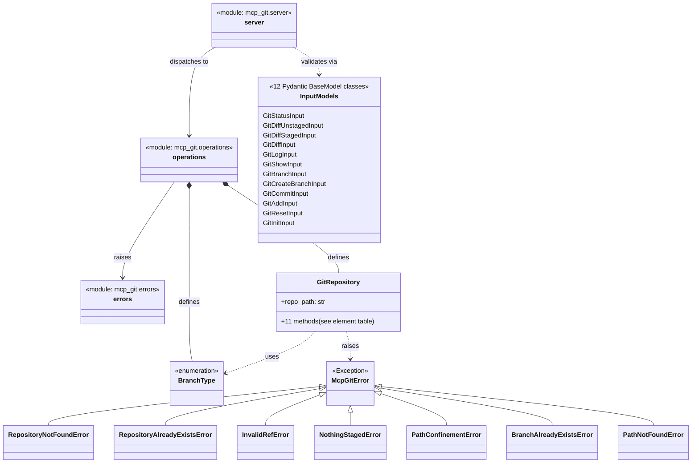

Created: 2026 August 13

# design-mcp-git-name_registry-master

**Name Registry — canonical element names across all design tiers**

---

## Table of Contents

[1.0 Class Diagram](<#1.0 class diagram>)
[2.0 Element Table](<#2.0 element table>)
[Version History](<#version history>)

---

## 1.0 Class Diagram

Purpose: visual skeleton of program elements and relationships. Populated incrementally — Tier 1 shows packages/modules only; classes are added at Tier 2; full function/constant detail is finalised at Tier 3.



Legend: modules shown as Tier 1 boxes; classes added at Tier 2 (GitRepository, McpGitError hierarchy) and finalised at Tier 3 (BranchType, the 12 Pydantic input models, and two additional exceptions — `BranchAlreadyExistsError`, `PathNotFoundError` — surfaced while finalising method signatures; see design-5b9d57cb-component_git_operations_repository.md §3.0). `<|--` denotes inheritance, `..>` denotes a raises/uses/validates dependency.

[Return to Table of Contents](<#table of contents>)

---

## 2.0 Element Table

```yaml
naming_conventions:
  package_style: "snake_case"
  module_style: "snake_case"
  class_style: "PascalCase"
  function_style: "snake_case"
  constant_style: "UPPER_SNAKE_CASE"

packages:
  - name: "mcp_git"
    path: "src/"

modules:
  - name: "mcp_git.server"
    import_path: "mcp_git.server"
    package: "mcp_git"
  - name: "mcp_git.operations"
    import_path: "mcp_git.operations"
    package: "mcp_git"
  - name: "mcp_git.errors"
    import_path: "mcp_git.errors"
    package: "mcp_git"

classes:
  - name: "GitRepository"
    module: "mcp_git.operations"
    base_classes: []
  - name: "McpGitError"
    module: "mcp_git.errors"
    base_classes:
      - "Exception"
  - name: "RepositoryNotFoundError"
    module: "mcp_git.errors"
    base_classes:
      - "McpGitError"
  - name: "RepositoryAlreadyExistsError"
    module: "mcp_git.errors"
    base_classes:
      - "McpGitError"
  - name: "InvalidRefError"
    module: "mcp_git.errors"
    base_classes:
      - "McpGitError"
  - name: "NothingStagedError"
    module: "mcp_git.errors"
    base_classes:
      - "McpGitError"
  - name: "PathConfinementError"
    module: "mcp_git.errors"
    base_classes:
      - "McpGitError"
  - name: "BranchAlreadyExistsError"
    module: "mcp_git.errors"
    base_classes:
      - "McpGitError"
  - name: "PathNotFoundError"
    module: "mcp_git.errors"
    base_classes:
      - "McpGitError"
  - name: "BranchType"
    module: "mcp_git.operations"
    base_classes:
      - "str"
      - "Enum"
  - name: "GitStatusInput"
    module: "mcp_git.server"
    base_classes: ["BaseModel"]
  - name: "GitDiffUnstagedInput"
    module: "mcp_git.server"
    base_classes: ["BaseModel"]
  - name: "GitDiffStagedInput"
    module: "mcp_git.server"
    base_classes: ["BaseModel"]
  - name: "GitDiffInput"
    module: "mcp_git.server"
    base_classes: ["BaseModel"]
  - name: "GitLogInput"
    module: "mcp_git.server"
    base_classes: ["BaseModel"]
  - name: "GitShowInput"
    module: "mcp_git.server"
    base_classes: ["BaseModel"]
  - name: "GitBranchInput"
    module: "mcp_git.server"
    base_classes: ["BaseModel"]
  - name: "GitCreateBranchInput"
    module: "mcp_git.server"
    base_classes: ["BaseModel"]
  - name: "GitCommitInput"
    module: "mcp_git.server"
    base_classes: ["BaseModel"]
  - name: "GitAddInput"
    module: "mcp_git.server"
    base_classes: ["BaseModel"]
  - name: "GitResetInput"
    module: "mcp_git.server"
    base_classes: ["BaseModel"]
  - name: "GitInitInput"
    module: "mcp_git.server"
    base_classes: ["BaseModel"]
# Finalised at Tier 3 component decomposition (design-b814443d-... and design-5b9d57cb-...).

functions:
  - name: "GitRepository.__init__"
    module: "mcp_git.operations"
    signature: "def __init__(self, repo_path: str) -> None"
  - name: "GitRepository.status"
    module: "mcp_git.operations"
    signature: "def status(self) -> dict"
  - name: "GitRepository.diff_unstaged"
    module: "mcp_git.operations"
    signature: "def diff_unstaged(self) -> str"
  - name: "GitRepository.diff_staged"
    module: "mcp_git.operations"
    signature: "def diff_staged(self) -> str"
  - name: "GitRepository.diff"
    module: "mcp_git.operations"
    signature: "def diff(self, target: str) -> str"
  - name: "GitRepository.log"
    module: "mcp_git.operations"
    signature: "def log(self, max_count: int = DEFAULT_LOG_MAX_COUNT) -> list[dict]"
  - name: "GitRepository.show"
    module: "mcp_git.operations"
    signature: "def show(self, ref: str) -> dict"
  - name: "GitRepository.branch"
    module: "mcp_git.operations"
    signature: "def branch(self, branch_type: BranchType = BranchType.LOCAL) -> dict"
  - name: "GitRepository.create_branch"
    module: "mcp_git.operations"
    signature: "def create_branch(self, branch_name: str, base_branch: Optional[str] = None) -> str"
  - name: "GitRepository.commit"
    module: "mcp_git.operations"
    signature: "def commit(self, message: str) -> str"
  - name: "GitRepository.add"
    module: "mcp_git.operations"
    signature: "def add(self, files: List[str]) -> dict"
  - name: "GitRepository.reset"
    module: "mcp_git.operations"
    signature: "def reset(self) -> dict"
  - name: "init_repository"
    module: "mcp_git.operations"
    signature: "def init_repository(repo_path: str) -> str"
  - name: "git_status"
    module: "mcp_git.server"
    signature: "async def git_status(params: GitStatusInput) -> str"
  - name: "git_diff_unstaged"
    module: "mcp_git.server"
    signature: "async def git_diff_unstaged(params: GitDiffUnstagedInput) -> str"
  - name: "git_diff_staged"
    module: "mcp_git.server"
    signature: "async def git_diff_staged(params: GitDiffStagedInput) -> str"
  - name: "git_diff"
    module: "mcp_git.server"
    signature: "async def git_diff(params: GitDiffInput) -> str"
  - name: "git_log"
    module: "mcp_git.server"
    signature: "async def git_log(params: GitLogInput) -> str"
  - name: "git_show"
    module: "mcp_git.server"
    signature: "async def git_show(params: GitShowInput) -> str"
  - name: "git_branch"
    module: "mcp_git.server"
    signature: "async def git_branch(params: GitBranchInput) -> str"
  - name: "git_create_branch"
    module: "mcp_git.server"
    signature: "async def git_create_branch(params: GitCreateBranchInput) -> str"
  - name: "git_commit"
    module: "mcp_git.server"
    signature: "async def git_commit(params: GitCommitInput) -> str"
  - name: "git_add"
    module: "mcp_git.server"
    signature: "async def git_add(params: GitAddInput) -> str"
  - name: "git_reset"
    module: "mcp_git.server"
    signature: "async def git_reset(params: GitResetInput) -> str"
  - name: "git_init"
    module: "mcp_git.server"
    signature: "async def git_init(params: GitInitInput) -> str"
# Finalised at Tier 3 component decomposition.

constants:
  - name: "DEFAULT_LOG_MAX_COUNT"
    module: "mcp_git.operations"
    type: "int"
```

[Return to Table of Contents](<#table of contents>)

---

## Version History

| Version | Date | Description |
|---|---|---|
| 0.1 | 2026-08-13 | Initialised at Tier 1: package and module names populated |
| 0.2 | 2026-08-13 | Extended at Tier 2: GitRepository and the McpGitError hierarchy (5 subclasses) added to classes; class diagram updated |
| 0.3 | 2026-08-13 | Finalised at Tier 3: BranchType, 12 Pydantic input models, and 2 additional exceptions (BranchAlreadyExistsError, PathNotFoundError) added to classes; 25 functions and 1 constant (DEFAULT_LOG_MAX_COUNT) added; class diagram updated. Registry is now canonical per governance §1.3.16. |

---

Copyright (c) 2026 William Watson. MIT License.
